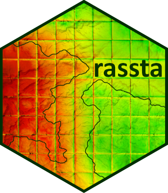
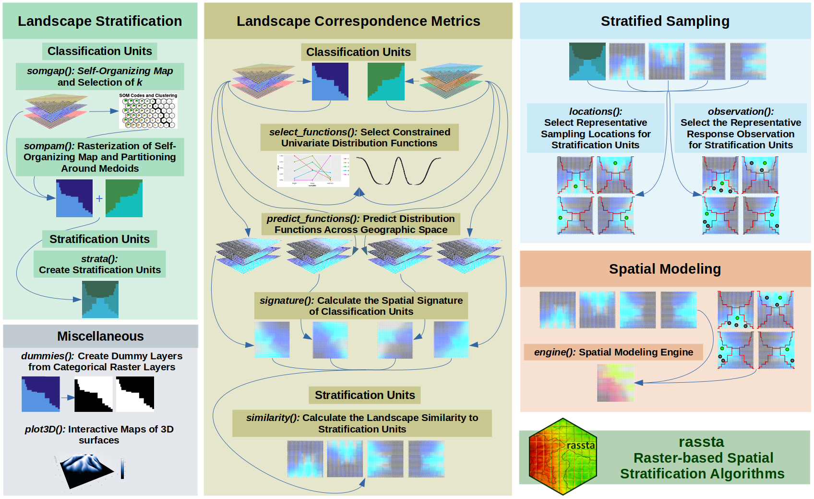

# rassta
<!-- badges: start -->

  

<!-- badges: end -->

 

`rassta` (**r**aster-based **s**patial **st**ratification **a**lgorithms) is a collection of algorithms for the spatial stratification of landscapes, sampling, and modeling of spatially-varying phenomena in [R](https://www.r-project.org).

`rassta` offers a simple framework for the stratification of geographic space based on raster layers representing landscape factors and/or factor scales. The stratification process follows a hierarchical approach, which is based on first level units (i.e., classification units) and second-level units (i.e., stratification units). Nonparametric techniques allow to measure the correspondence between the geographic space and the landscape configuration represented by the units. These correspondence metrics are useful to define sampling schemes and to model the spatial variability of environmental phenomena.

## Installation

`rassta` is available from CRAN, so the current **released version** can be installed as follows:

    install.packages("rassta")

To install the development version from github, please use:

    remotes::install_github("bafuentes/rassta")

## Cheat Sheet

    
    

Full documentation of `rassta` including some vignettes can be found [here](https://bafuentes.github.io/rassta/)

## Acknowledgments

`rassta` greatly benefits from past and current efforts to make spatial data analysis fully operational in R, which in turn have benefited from titans like GDAL, PROJ, GEOS, etc. Special thanks to the minds behind the `terra`, `rgdal`, `rgeos`, and `sf` packages, and those behind the packages that `rassta` depends on as well.

## Citation

A journal article describing the methods and theoretical background of `rassta` has been accepted by the R Journal and now it is in press. In the meantime, if you use `rassta` as part of your research please cite the EarthArXiv preprint in your work:

B.A. Fuentes, M.J. Dorantes, and J.R. Tipton. rassta: Raster-Based Spatial Stratification Algorithms. *EarthArXiv*, 2021. <https://doi.org/10.31223/X50S57>
